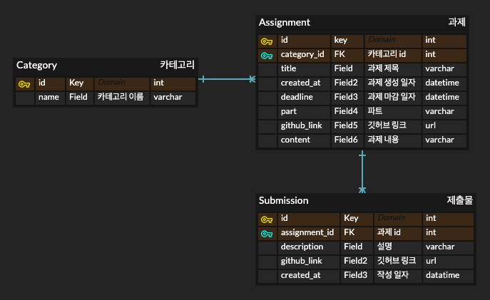
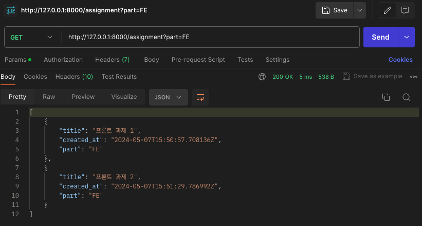
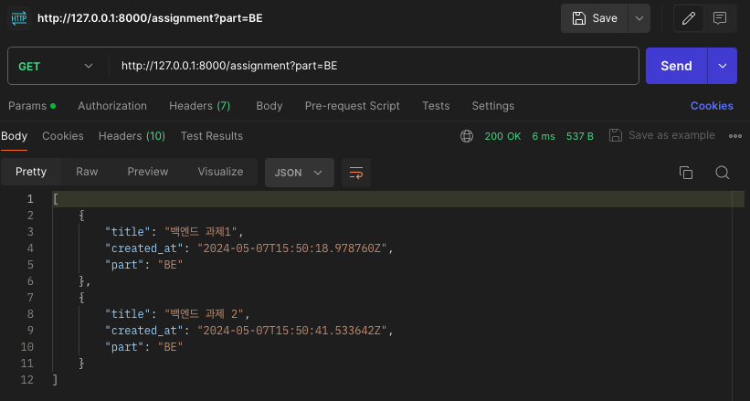
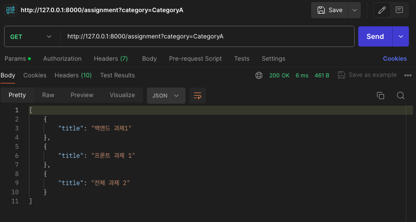

# drf-advanced-team2

drf실습 2팀 과제 레포입니다.

# ERD

- 과제:카테고리를 N:1 관계로 설정했습니다.
- 과제:제출물을 1:N 관계로 설정했습니다.

# API 명세서

마지막에 넣을게요

# API 한 줄 설명 + postman 스크린샷

### 4. 특정 과제 조회 api

- path parameter로 조회하고자 하는 과제의 id를 받아와서, 해당 과제와 제출물들의 정보까지 return합니다.
  

### 7. 파트별 과제 조회 api

- query string으로 조회하고자 하는 파티를 받아와서, 해당하는 과제들의 제목, 생성 일자, 파트를 return합니다.
  
  
  

### 8. 카테고리별 과제 조회 api

- query string으로 조회하고자 하는 카테고리를 받아와서, 해당하는 과제들의 제목을 return합니다.

  
