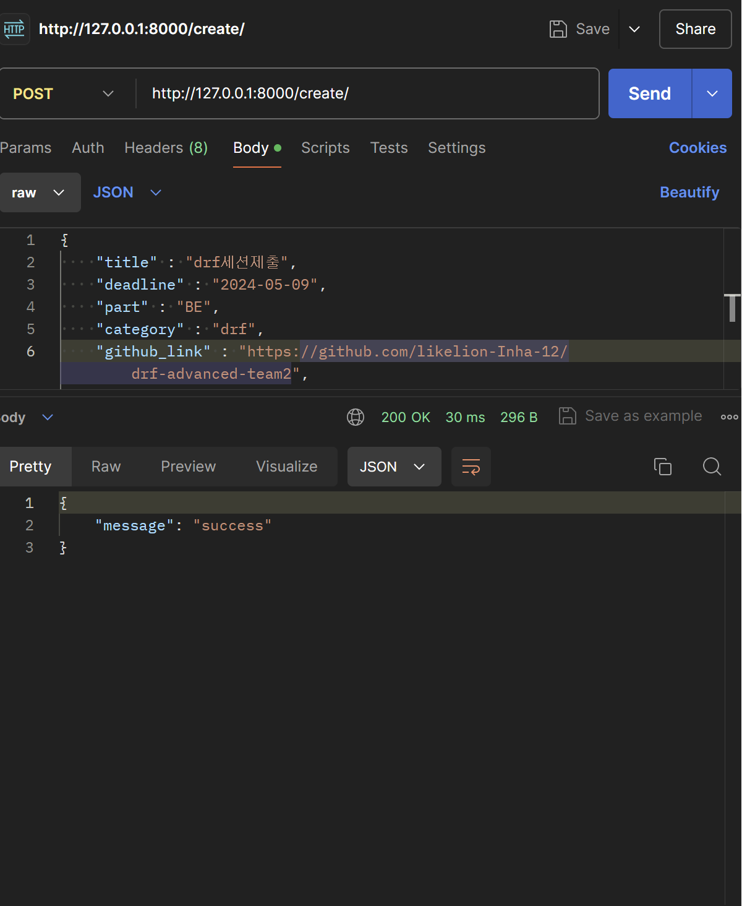
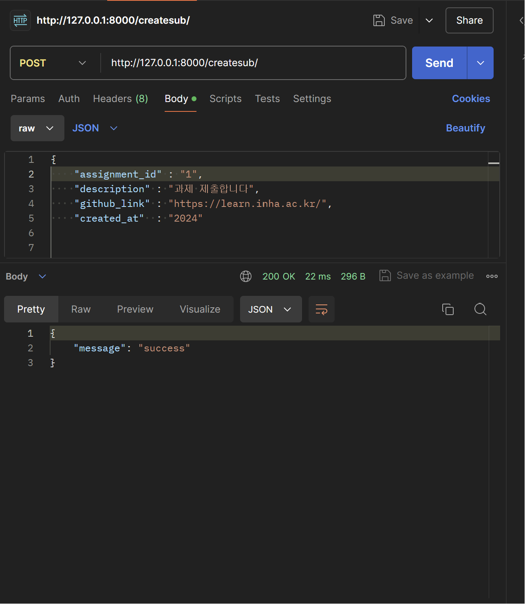
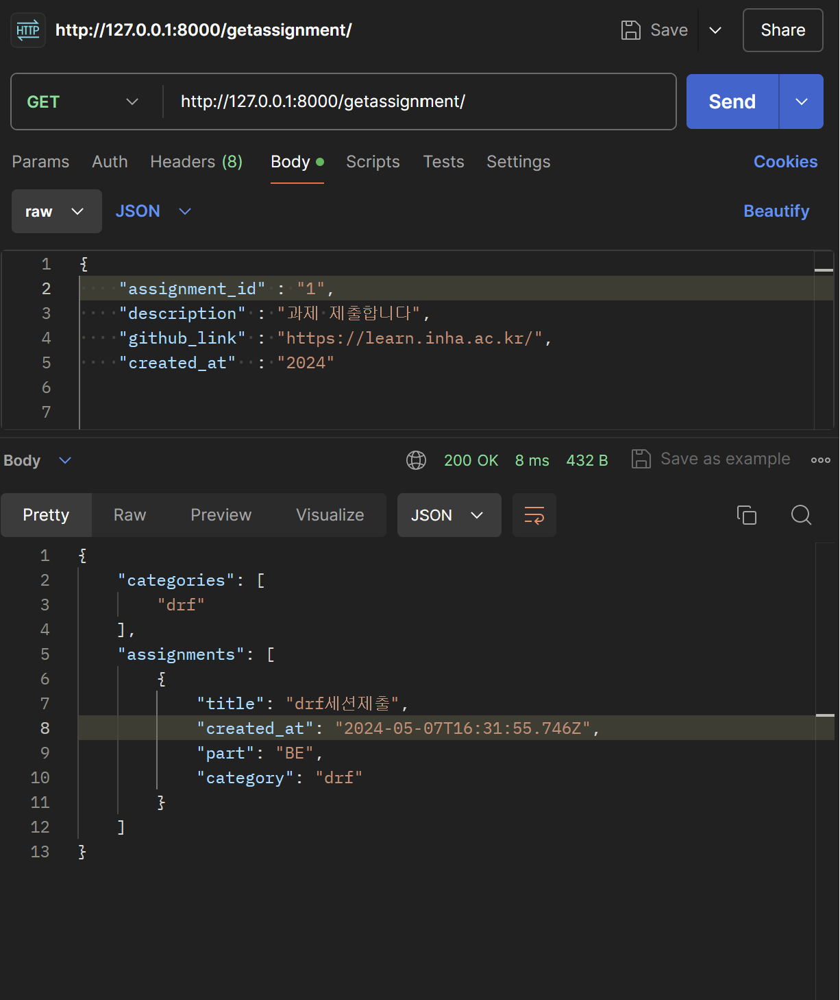
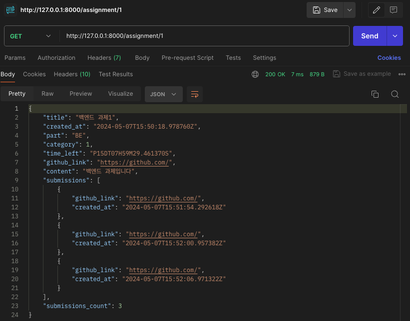

# drf-advanced-team2

drf실습 2팀 과제 레포입니다.
### 1. 과제를 생성합니다.
-특정 과제를 생성합니다
  
### 2. 특정 과제에 대한 제출물을 생성할 수 있습니다.
-과제의 id를 받아온 후 해당과제에 대한 제출물을 생성합니다
  

### 3. 생성되어 있는 전체 과제들의 목록을 조회할 수 있습니다. 
- 그동안 만들었던 category 및 과제들의 목록을 return합니다
  

### 4. 특정 과제 조회 api

- path parameter로 조회하고자 하는 과제의 id를 받아와서, 해당 과제와 제출물들의 정보까지 return합니다.
  
